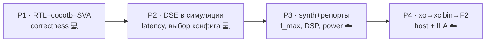

# gemm_kernelgen — workload-aware INT8 systolic GEMM с генерацией и флоу до ILA

Параметризованный **INT8 систолический MAC-массив** на SystemVerilog +
**Python-генератор/autotuner**, который порождает конфиги, проверяет корректность
и меряет перф в реальной симуляции, и **сквозной FPGA-флоу** от RTL до отладки
на кремнии через ILA (AWS F2 / Alveo). Personal reference-проект: аппаратное
ускорение плотного matmul под конкретный workload, с co-design алгоритм↔железо.

> Числа честно помечены по источнику: **латентность — измерена в симуляции**,
> **f_max/DSP/LUT/power — из синтеза (Vivado)**, **замер на кремнии — на F2**.
> Никакие estimate не выдаются за measured.

## Что внутри

```
rtl/       pe.sv · systolic_array.sv · gemm_kernel.sv   (ядро + Vitis-обёртка)
tb/        test_systolic.py · test_eval.py · systolic_sva.sv  (cocotb + SVA)
ref/       golden.py                                    (эталон matmul)
gen/       generator.py · evaluate.py · search.py · ai_propose.py  (DSE-петля)
flow/      synth.tcl · package_kernel.tcl · build_hw.sh · constraints.xdc
host/      run_hw.py                                    (XRT-хост)
scripts/   Makefile · run.sh                            (оркестрация)
docs/      style_notes · report_analysis · flow_walkthrough · cloud_setup
```

## Архитектура (dataflow)

Output-stationary: активация `a` едет вправо, операнд `b` — вниз, PE(i,j) держит
`C[i][j]`. Систолический skew: пара `(A[i][k], B[k][j])` встречается в PE(i,j)
на такте `k+i+j` → латентность детерминирована.

```
        b0   b1   b2   b3            (B сверху, со skew по столбцам)
         │    │    │    │
  a0 ── PE─→ PE─→ PE─→ PE            PE = INT8 MAC, acc += a*b
         ↓    ↓    ↓    ↓            a → вправо (рег), b → вниз (рег)
  a1 ── PE─→ PE─→ PE─→ PE
         ↓    ↓    ↓    ↓
  a2 ── PE─→ PE─→ PE─→ PE            после (K-1)+(M-1)+(N-1)+1 тактов
         ↓    ↓    ↓    ↓            все acc(i,j) = C[i][j]
  a3 ── PE─→ PE─→ PE─→ PE
```

Полный GEMM (M,N,K) тайлится сеткой `ceil(M/ARRAY_M)×ceil(N/ARRAY_N)`; генератор
подбирает `ARRAY_M×ARRAY_N` под бюджет PE, максимизируя throughput.

## Пайплайн проекта



## Запуск

**Локально (нужен fpga-venv):**
```bash
source /Users/alex/fpga-venv/bin/activate
./scripts/run.sh sim                       # P1: self-check + coverage + SVA
./scripts/run.sh dse                       # P2: DSE grid+hillclimb → results/dse.json
cd scripts && make kernel                   # AXI-kernel: полный DMA-датапат vs golden
#   make kernel ARRAY_M=8 ARRAY_N=8 KERNEL_K=8
```
`make kernel` verифицирует ПОЛНУЮ обёртку (AXI-Lite control + AXI-master DMA +
систолика + сбор + запись) в симуляции против golden — ловит баги датапата ДО
дорогого F2-bring-up. Проверено на 4×4, 2×6, 6×3, 8×8 и разных K.

**В облаке (P3–P4, Vivado/Vitis + F2) — всё из терминала, без GUI:**
точная последовательность команд → [docs/cloud_runbook.md](docs/cloud_runbook.md);
setup инстанса → [docs/cloud_setup.md](docs/cloud_setup.md);
подробный флоу + headless ILA → [docs/flow_walkthrough.md](docs/flow_walkthrough.md).

## Результат DSE (пример, GEMM 64×64×64, бюджет 64 PE)

| конфиг | PE | latency (sim) | MAC/такт (модель) | MAC/такт/PE |
|---|---|---|---|---|
| 8×8 | 64 | 22 | **186.2** | 2.91 |
| 4×8 | 32 | 18 | 113.8 | 3.56 |
| 4×4 | 16 | 14 | 73.1 | 4.57 |
| 2×2 | 4 | 10 | 25.6 | **6.40** |

Классический trade-off: больше PE → выше абсолютный throughput, но ниже
эффективность на PE (fill/drain + латентность). Всё **измерено в симуляции**.

## Метрики по источникам (честность)
| Метрика | Источник | Статус |
|---|---|---|
| latency тайла | Verilator sim (P2) | измерено, детерминировано |
| throughput MAC/такт | модель (tiles × latency) | расчёт из измеренного |
| f_max, DSP/LUT, power | Vivado synth (P3) | синтез, не замер |
| GEMM на кремнии | XRT на F2 (P4) | замер на железе |

## Стек
SystemVerilog · Verilator · cocotb · Python · Vivado/Vitis · XRT · AWS F2/Alveo.
Стиль RTL — lowRISC ([docs/style_notes.md](docs/style_notes.md)).
